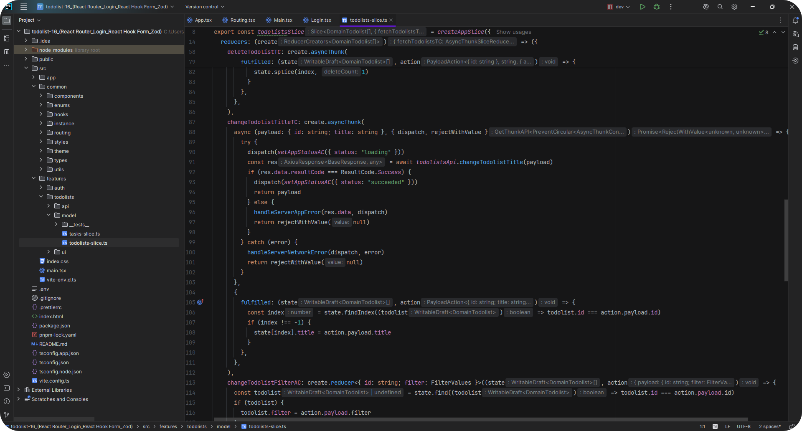

# WebStorm Dark Pur DEF
Dark minimalist theme for JetBrains WebStorm. 
I have preserved all functionality of the original dark theme, but made it more contrasting  

## Features
- Dark, comfortable on the eyes
- Minimalist color scheme for code and UI
- Optimized for WebStorm

## Local Installation
1. Clone repository: git clone https://github.com/reflectline/webstorm_darkpure.git
2. Extract Dark_Pur_DEF.jar archive from the repository and place it in any convenient location on your PC. 
3. Open WebStorm. Click the gear icon in the top-right corner → Plugins... 
4. In the Plugins window, click the gear icon → Install Plugin from Disk… 
5. Select the Dark_Pur_DEF.jar file, click Open, and restart WebStorm when prompted.

## Usage
1. After restarting WebStorm, click the gear icon in the top-right corner → Theme...
2. Select Dark Pur DEF from the list to apply the theme.